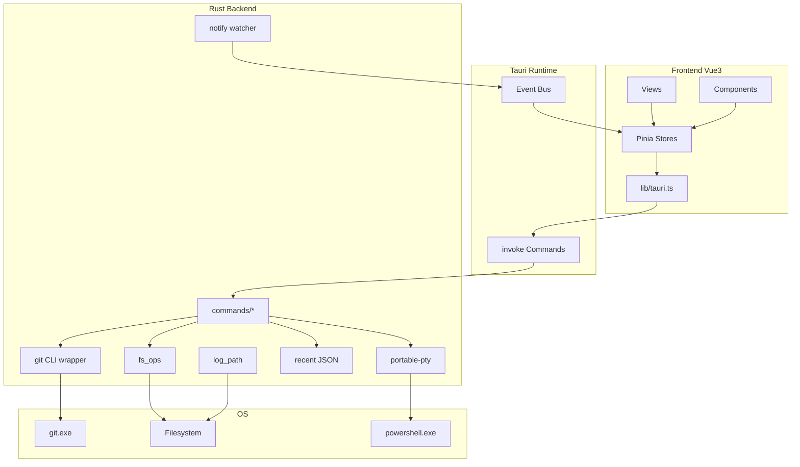
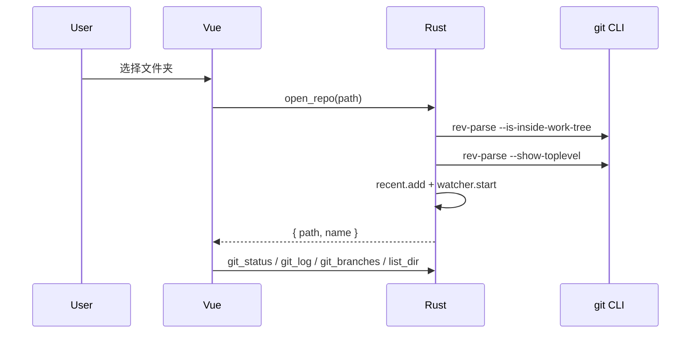
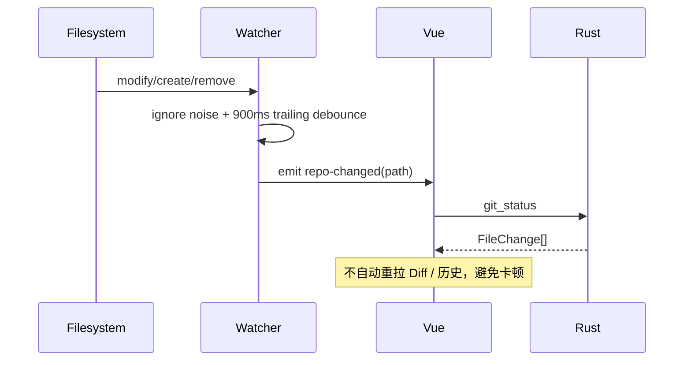
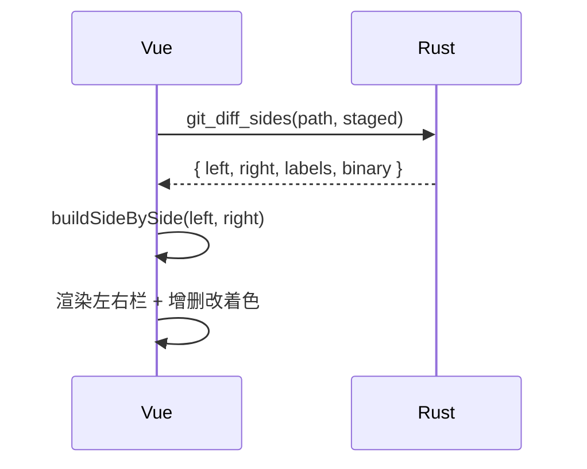

# 01 · 产品概述

## 1.1 背景与目标

GitDiff 是一款面向日常开发的 **本地 Windows 轻量 Git 客户端**，定位介于 VS Code 内置 Git 面板与 SourceTree 之间：

- 像 VS Code 一样快速查看变更、暂存、提交、推送
- 像 SourceTree 一样浏览提交历史与文件变更
- 额外提供文件树编辑、内置终端、左右 Diff 对比

核心目标：**上手快、界面轻、不离开本机、复用系统 Git 凭据**。

## 1.2 功能范围（当前版本）

### 已实现

| 能力       | 说明                                         |
| ---------- | -------------------------------------------- |
| 打开仓库   | 选择文件夹；必须是 Git 仓库                  |
| 最近项目   | 本地 JSON 持久化，最多 20 条                 |
| 变更列表   | staged / unstaged / untracked                |
| 暂存与提交 | stage / unstage / commit                     |
| 远程操作   | pull（merge）/ push                          |
| Diff       | 左右对比 + 统一视图；增删改着色；差异点跳转  |
| 分支       | 列表、切换、创建                             |
| 历史       | 最近 100 条提交；文件列表；中间区查看详情    |
| 文件树     | 浏览仓库文件，打开并编辑、保存               |
| 终端       | 底部可折叠 PowerShell PTY，可拖动调高        |
| 主题       | 深色 / 浅色，localStorage 记忆               |
| 日志       | 应用内日志面板 + 安装目录 `logs/gitdiff.log` |
| 品牌       | 自定义 GitDiff LOGO / 应用图标               |

### 明确不做（首版）

- Merge / Rebase 可视化、冲突解决 UI
- Stash、子模块、多远程高级管理
- 内置账号密码弹窗（走系统 credential helper / SSH agent）
- 云同步、公网暴露、内网穿透

## 1.3 技术选型

| 层级      | 选型                            | 原因                                    |
| --------- | ------------------------------- | --------------------------------------- |
| 桌面壳    | Tauri 2                         | 体积小、Rust 后端安全、Windows 打包成熟 |
| 前端      | Vue 3 + TS + Vite               | 组件化清晰、开发体验好                  |
| 状态      | Pinia                           | 与 Vue 3 契合，模块化 store             |
| Git       | 系统 `git` CLI                  | 凭据/SSH 直接复用，功能完整             |
| 文件监听  | `notify`                        | 工作区变更后刷新 status                 |
| Diff 算法 | `diff`（npm）                   | 基于两侧文本构建左右对比行              |
| 终端      | `portable-pty` + `@xterm/xterm` | 真终端交互                              |
| 日志      | `tauri-plugin-log`              | 文件日志 + 级别控制                     |
| 对话框    | `tauri-plugin-dialog`           | 打开文件夹                              |

## 1.4 运行约束

1. 本机需安装 Git，并在 `PATH` 中可用。
2. 仅本地使用：不上传仓库内容，不生成公网链接，不做端口映射/穿透。
3. 推送鉴权依赖系统已配置的凭据助手或 SSH agent。
4. 日志优先写到可执行文件同级 `logs/`；若目录不可写（如 Program Files），回退到 `%LOCALAPPDATA%\GitDiff\logs\`。

## 1.5 版本信息

- 产品名：`GitDiff`
- 版本：`0.1.0`
- Bundle ID：`com.gitdiff.app`
- 默认窗口：`1280×800`，最小 `960×600`

# 02 · 整体架构

## 2.1 分层结构



## 2.2 进程与职责

| 进程/线程            | 职责                                    |
| -------------------- | --------------------------------------- |
| WebView（前端）      | UI 渲染、用户交互、状态管理、xterm 展示 |
| Tauri 主进程（Rust） | 命令处理、Git 调用、文件读写、PTY、监听 |
| Watcher 后台线程     | 目录变更防抖后 emit `repo-changed`      |
| PTY 读线程           | 将终端输出通过 `terminal-data` 推到前端 |

## 2.3 核心原则

1. **Git 真相源在 CLI**：所有 Git 语义以本机 `git` 为准，前端只做展示与编排。

2. **命令薄封装**：Rust 侧统一 `run_git`，解析 porcelain / log 输出后返回结构化数据。

3. **事件驱动刷新**：工作区文件变化 → watcher 防抖 → 前端只刷新变更列表，避免全量重载。

4. **中心视图多模式**：差异 / 编辑 / 历史详情共用中间区域，减少面板挤占。

5. 性能优先

   ：

   - 不做 Webview 日志洪水回灌
   - Diff 大文件截断渲染
   - FS 监听忽略 `node_modules` / `.git` 等噪声目录

## 2.4 主交互数据流

### 打开仓库



### 文件变更自动刷新



### 左右 Diff



## 2.5 安全边界

- 所有文件读写路径必须落在当前仓库根目录下（防路径穿越）。
- 终端与 Git 都在本地进程执行，不对外暴露端口。
- `GIT_TERMINAL_PROMPT=0`，避免命令卡在交互凭据提示。

# 03 · 模块设计

## 3.1 仓库目录结构

```text
gitdiff/
├── docs/                      # 设计文档
├── assets/                    # LOGO 源文件
├── public/                    # 静态资源（favicon 等）
├── src/                       # 前端
│   ├── App.vue
│   ├── main.ts
│   ├── styles/main.css
│   ├── views/                 # 页面级视图
│   ├── components/            # UI 组件
│   ├── stores/                # Pinia
│   └── lib/                   # API / 类型 / Diff 算法
└── src-tauri/                 # Rust / Tauri
    ├── capabilities/
    ├── icons/
    ├── tauri.conf.json
    └── src/
        ├── lib.rs             # 应用入口与 command 注册
        ├── git/               # git CLI 封装与解析
        ├── commands/          # Tauri commands
        ├── watcher.rs
        ├── recent.rs
        └── log_path.rs
```

## 3.2 前端模块职责

| 模块                      | 职责                                |
| ------------------------- | ----------------------------------- |
| `views/WelcomeView.vue`   | 欢迎页：打开仓库、最近项目          |
| `views/WorkspaceView.vue` | 工作区总布局：左栏/中栏/右栏/终端   |
| `stores/repo.ts`          | 当前仓库、Git 检测、toast、最近项目 |
| `stores/changes.ts`       | 变更列表、Diff 数据、提交           |
| `stores/history.ts`       | 提交历史与历史文件详情              |
| `stores/branches.ts`      | 分支与 pull/push                    |
| `stores/files.ts`         | 文件树展开状态、读写编辑            |
| `stores/ui.ts`            | 左侧 Tab、中心视图、终端开关        |
| `stores/theme.ts`         | 深浅色主题                          |
| `stores/log.ts`           | 应用内日志面板                      |
| `lib/tauri.ts`            | 类型化 invoke 封装                  |
| `lib/sideBySide.ts`       | 两侧文本 → 对齐 Diff 行             |
| `lib/types.ts`            | 前后端共享 TS 类型                  |

## 3.3 后端模块职责

| 模块                   | 职责                                     |
| ---------------------- | ---------------------------------------- |
| `git/mod.rs`           | `run_git` / `check_git` / 仓库判定       |
| `git/parse.rs`         | status / log / branch / name-status 解析 |
| `commands/repo.rs`     | 打开/关闭仓库、最近项目                  |
| `commands/git_*.rs`    | status/diff/commit/remote/log/branch     |
| `commands/fs_ops.rs`   | 目录列表、文本读写（路径沙箱）           |
| `commands/terminal.rs` | PTY 创建/写入/缩放/关闭                  |
| `watcher.rs`           | 工作区监听 + 防抖事件                    |
| `recent.rs`            | `recent-projects.json`                   |
| `log_path.rs`          | 日志目录解析（安装目录优先）             |

## 3.4 模块依赖关系（简化）

```text
App
 ├─ WelcomeView ── repoStore
 └─ WorkspaceView
     ├─ uiStore（布局模式）
     ├─ ChangesPanel / FileTree
     ├─ DiffViewer / FileEditor / HistoryDiffView
     ├─ HistoryPanel / CommitBox / BranchBar
     └─ TerminalPanel
            │
            ▼
        lib/tauri.ts  ──invoke/events──►  src-tauri commands
```

## 3.5 扩展点建议

后续若要加功能，优先落点：

1. **新 Git 能力**：在 `commands/git_*.rs` + `lib/tauri.ts` + 对应 store
2. **新中心视图**：扩展 `ui.centerView` 枚举与 `WorkspaceView` 切换区
3. **新持久化配置**：仿 `recent.rs` / `theme` localStorage 模式
4. **冲突解决**：新增独立视图，避免塞进 DiffViewer

# 04 · 后端设计（Rust / Tauri）

## 4.1 启动流程

`src-tauri/src/lib.rs`：

1. 解析日志目录（`log_path::resolve_log_dir`）
2. 初始化插件：`opener` / `dialog` / `log`
3. `manage(TerminalState)`
4. 注册全部 `#[tauri::command]`
5. `run(generate_context!())`

日志目标：

- Stdout
- Folder：`<exe_dir>/logs/gitdiff.log`（失败则回退 LocalAppData）

**注意**：不再启用 `TargetKind::Webview`，避免日志回灌导致 UI 卡顿。

## 4.2 Git CLI 封装

文件：`src-tauri/src/git/mod.rs`

### `run_git(cwd, args)`

- 进程：`git <args>`，工作目录为仓库路径
- 环境：`GIT_TERMINAL_PROMPT=0`，`LANG/LC_ALL=C`
- Windows：`CREATE_NO_WINDOW`，避免弹出控制台黑窗
- 返回：`{ stdout, stderr, code }`
- 日志策略：
  - `status/diff/log/branch/show/rev-parse` 成功走 debug（默认不刷屏）
  - `commit/push/pull/checkout` 等走 info
  - `diff` exit code `1` 视为“有差异”，不算失败

### 解析器（`git/parse.rs`）

| 输入                              | 输出                                           |
| --------------------------------- | ---------------------------------------------- |
| `git status --porcelain=v1 -uall` | `FileChange[]`（含 staged/unstaged/untracked） |
| `git log --pretty=format:...`     | `CommitInfo[]`                                 |
| `git show --name-status`          | `CommitFile[]`                                 |
| `git branch --list`               | `BranchInfo[]`                                 |

Status 中同一文件可同时出现 staged + unstaged 两条记录（如 `MM`）。

## 4.3 仓库与最近项目

### 打开仓库 `open_repo`

1. 校验目录存在
2. `rev-parse --is-inside-work-tree`
3. `rev-parse --show-toplevel` 归一化根路径
4. 写入最近项目
5. 启动 watcher
6. 返回 `{ path, name }`

### 最近项目 `recent.rs`

- 路径：`app_data_dir/recent-projects.json`
- 字段：`path` / `name` / `lastOpenedAt`
- 上限：20 条，打开成功后置顶

## 4.4 文件监听 `watcher.rs`

- crate：`notify` 递归监听仓库根
- 忽略目录/文件：`.git`、`node_modules`、`target`、`dist`、`build`、锁文件等
- 忽略事件类型：Access / Other
- 防抖：trailing **900ms**（安静后才 emit）
- 事件名：`repo-changed`，payload 为仓库路径字符串
- 切换/关闭仓库时停止旧 watcher

## 4.5 Diff 两侧内容 `git_diff_sides`

根据区域决定左右文本：

| 场景          | Left             | Right            |
| ------------- | ---------------- | ---------------- |
| staged        | `HEAD:path`      | `:path`（index） |
| untracked     | 空               | 工作区文件       |
| 其他 unstaged | `:path`（index） | 工作区文件       |

含二进制检测（前 8KB 出现 `NUL` 则 `binary=true`）。

同时保留 `git_diff` 输出 unified patch，供统一视图使用。

## 4.6 文件系统 `fs_ops.rs`

### 路径沙箱

- 统一 canonicalize，并剥离 Windows `\\?\` 前缀后再做 `starts_with` / `strip_prefix`
- 禁止 `..` 逃逸出仓库根
- 这是文件树相对路径曾算空字符串的根因修复点

### `list_dir`

- 跳过噪声目录与大多数点文件（保留 `.gitignore` / `.env` 等）
- 目录优先、名称排序
- 返回 `{ name, path, isDir }`，`path` 使用 `/` 相对路径

### `read_text_file` / `write_text_file`

- 仅文本；二进制拒绝编辑
- 写文件可创建缺失父目录

## 4.7 终端 `terminal.rs`

基于 `portable-pty`：

| 命令              | 作用                                                      |
| ----------------- | --------------------------------------------------------- |
| `terminal_create` | 开 PTY，Windows 默认 `powershell.exe -NoLogo`，cwd 为仓库 |
| `terminal_write`  | 写 stdin                                                  |
| `terminal_resize` | 调整行列                                                  |
| `terminal_close`  | 移除会话                                                  |

输出通过事件：

- `terminal-data`：`{ id, data }`
- `terminal-exit`：`{ id }`

会话保存在 `TerminalState`（`HashMap<id, session>`），并保持 child 存活。

## 4.8 远程与分支

- `git_push` / `git_pull --rebase=false`
- 成功时 stderr 也可能有信息，需合并展示
- 分支：`branch --list` / `checkout` / `checkout -b`

## 4.9 错误处理约定

- 命令统一 `Result<T, String>`
- 前端 toast：error 进日志面板；success 不刷日志（防打扰）
- Git 缺失时启动即提示，禁止继续打开仓库

# 05 · 前端设计（Vue 3 / Pinia）

## 5.1 技术组成

- Vue 3 `<script setup>` + TypeScript
- Pinia 组合式 store
- Vite 6 构建
- `@tauri-apps/api` / plugins
- `diff`：行级 diff
- `@xterm/xterm` + `@xterm/addon-fit`：终端 UI

入口：`src/main.ts` → 创建 Pinia → 挂载 `App.vue`。

## 5.2 应用壳 `App.vue`

全局常驻：

- 顶栏：品牌、主题切换、日志开关
- 主视图：`WelcomeView` 或 `WorkspaceView`
- 底部可展开：`LogPanel`
- Toast 提示

启动时：

1. `check_git`
2. `list_recent`
3. 写一条“应用已启动”日志

## 5.3 状态管理

### `repo`

- `path` / `name` / `gitVersion` / `gitError` / `recent`
- `open` / `close` / `loadRecent` / `showToast`

### `changes`

- `files`、`selected`、`diffText`、`diffSides`、`viewMode`
- `stage` / `unstage` / `commit` / `selectFile`
- 选中变更文件时切换中心视图到 `diff`

### `history`

- `commits`、`files`、`selectedHash`、`selectedFile`、`detailDiff`
- 点击历史文件 → 拉 patch → 中心视图切到 `historyDiff`

### `branches`

- 分支列表、当前分支、checkout/create、pull/push

### `files`

- `rootEntries`、`openDirs`、`childrenMap`
- `isExpanded` / `childrenOf` / `toggleDir` / `openFile` / `save`
- 脏标记 `dirty`，Ctrl+S 保存

### `ui`

- `leftTab`: `changes | files`
- `centerView`: `diff | editor | historyDiff`
- `terminalOpen`

### `theme`

- `dark | light`，`data-theme` 挂到 `documentElement`
- localStorage：`gitdiff.theme`

### `log`

- 内存环形缓冲（最多 200 条）
- 级别过滤、面板开关

## 5.4 关键组件

| 组件                        | 作用                          |
| --------------------------- | ----------------------------- |
| `ChangesPanel`              | 暂存区/工作区列表，增删改标签 |
| `DiffViewer`                | 左右/统一 Diff、差异跳转      |
| `FileTree` / `FileTreeNode` | 递归文件树                    |
| `FileEditor`                | 文本编辑与保存                |
| `HistoryPanel`              | 提交列表 + 变更文件列表       |
| `HistoryDiffView`           | 历史 patch 彩色展示（中心区） |
| `CommitBox`                 | message + 提交/拉取/推送      |
| `BranchBar`                 | 分支切换/新建                 |
| `TerminalPanel`             | xterm + 高度拖拽              |
| `ThemeToggle` / `LogPanel`  | 主题与日志                    |
| `icons/*`                   | 刷新、终端等 SVG 图标         |

## 5.5 Diff 前端算法

文件：`src/lib/sideBySide.ts`

1. `diffLines(left, right)` 得到变更块
2. 相邻 `removed + added` 合并为 **修改（mod）**
3. 生成对齐行：`equal | add | del | mod`
4. 默认最多 2000 行，防止超大文件卡死
5. 渲染采用 `v-html` 批量字符串，避免成千上万 VNode

跳转逻辑：

- 收集非 `equal` 行索引
- 「上一个 / 下一个」滚动并高亮 `active-hunk`

## 5.6 性能策略（前端）

1. `repo-changed` 仅刷新 `git_status`，并做 250ms 合并
2. 不在每次 FS 事件时重拉 Diff
3. 历史详情放到中心区，右侧只保留列表
4. 终端高度、主题等偏好本地记忆，减少打扰

## 5.7 样式体系

`src/styles/main.css` 通过 CSS 变量支持双主题：

- 深色默认（青石色 accent `#14b8a6`）
- 浅色（`data-theme="light"`）
- Diff 语义色：删除红 / 新增绿 / 修改琥珀

终端面板强制深色底与浅色按钮字，避免浅色主题下不可读。

# 06 · 界面与交互设计

## 6.1 信息架构

```text
App
├─ 全局顶栏（品牌 / 主题 / 日志）
├─ Welcome（未打开仓库）
│  ├─ 打开文件夹
│  └─ 最近项目
└─ Workspace（已打开仓库）
   ├─ 工作区顶栏（仓库名、路径、分支、终端、刷新、关闭）
   ├─ 主内容三栏
   │  ├─ 左：变更 | 文件
   │  ├─ 中：差异 | 编辑 | 历史详情 + 提交框
   │  └─ 右：History
   ├─ 底部终端（可折叠、可拖高）
   └─ 全局日志面板（可折叠）
```

## 6.2 工作区布局

```text
┌──────────────────────────────────────────────────────────┐
│ GitDiff   repo-name   [branch]   [终端] [刷新] [关闭]     │
├────────────┬─────────────────────────────┬───────────────┤
│ 变更|文件   │ 差异 | 编辑 | 历史详情        │ History       │
│            │                             │ 提交列表      │
│ 列表/树    │ 主内容区                     │───────────────│
│            │                             │ 变更文件列表  │
│            │─────────────────────────────│               │
│            │ Commit message / 提交推送    │               │
├────────────┴─────────────────────────────┴───────────────┤
│ ▭ 拖动手柄                                                │
│ 终端栏（重启 / 收起）                                      │
│ xterm                                                     │
└──────────────────────────────────────────────────────────┘
```

栅格大致比例：`300px | 1fr | 340px`。

## 6.3 关键交互流

### 变更 → Diff

1. 左栏「变更」点文件
2. 中心自动切到「差异」
3. 默认左右对比；可切统一视图
4. 使用「上一个/下一个」跳差异点

### 文件树 → 编辑

1. 左栏「文件」展开目录、点文件
2. 中心切到「编辑」
3. 修改后显示「未保存」；Ctrl+S 或点保存

### History → 历史详情

1. 右侧点提交 → 下方列出变更文件
2. 点文件 → 中心「历史详情」展示彩色 patch
    （解决旧版右下角详情被挤压看不见的问题）

### 终端

1. 顶栏终端图标开关
2. 顶部拖动手柄调整高度（140px ~ 窗口 70%）
3. 高度写入 `localStorage: gitdiff.terminalHeight`
4. 重启按钮重建 PTY；收起销毁会话

## 6.4 视觉语义

| 语义     | 颜色意图    | 出现位置                       |
| -------- | ----------- | ------------------------------ |
| 新增     | 绿色        | 变更标签、Diff 行、历史 status |
| 删除     | 红色        | 同上                           |
| 修改     | 琥珀色      | 同上                           |
| 强调操作 | 青色 accent | 主按钮、激活 Tab、分支 hash    |

## 6.5 LOGO / 图标

设计概念：

- 深色圆角底
- 中心白色 Git 分支
- 左青「−」条、右琥珀「+」条（呼应 Diff）

产出：

- 源图：`assets/gitdiff-logo.png`、`app-icon.png`
- Tauri 图标集：`src-tauri/icons/*`
- Web favicon：`public/favicon.png`

生成命令：

```bash
npx tauri icon app-icon.png -o src-tauri/icons
```

## 6.6 可达性与可用性注意

- 图标按钮均带 `title`
- 长路径省略号 + native tooltip
- 空态文案明确引导下一步操作
- 危险/成功反馈通过 toast，重要错误进日志

# 07 · 命令与事件 API

前端统一通过 `src/lib/tauri.ts` 的 `api.*` 调用。

## 7.1 仓库与环境

| Command         | 参数   | 返回              | 说明                     |
| --------------- | ------ | ----------------- | ------------------------ |
| `check_git`     | —      | `string`          | `git --version`          |
| `open_repo`     | `path` | `OpenRepoResult`  | 校验并打开，启动 watcher |
| `close_repo`    | —      | `void`            | 停止 watcher             |
| `list_recent`   | —      | `RecentProject[]` | 最近项目                 |
| `remove_recent` | `path` | `RecentProject[]` | 移除并返回新列表         |

## 7.2 Git 状态与变更

| Command       | 参数                | 返回           |
| ------------- | ------------------- | -------------- |
| `git_status`  | `repoPath`          | `FileChange[]` |
| `git_stage`   | `repoPath, paths[]` | `void`         |
| `git_unstage` | `repoPath, paths[]` | `void`         |
| `git_commit`  | `repoPath, message` | `string`       |

`FileChange`：

```ts
{
  path: string
  oldPath: string | null
  indexStatus: string
  worktreeStatus: string
  area: "staged" | "unstaged" | "untracked"
  statusLabel: string
}
```

## 7.3 Diff

| Command          | 参数                     | 返回                     |
| ---------------- | ------------------------ | ------------------------ |
| `git_diff`       | `repoPath, path, staged` | `string`（unified）      |
| `git_diff_sides` | `repoPath, path, staged` | `DiffSides`              |
| `git_show_file`  | `repoPath, commit, path` | `string`（commit patch） |

`DiffSides`：

```ts
{
  left: string
  right: string
  leftLabel: string
  rightLabel: string
  binary: boolean
}
```

## 7.4 远程 / 分支 / 历史

| Command              | 参数               | 返回           |
| -------------------- | ------------------ | -------------- |
| `git_push`           | `repoPath`         | `string`       |
| `git_pull`           | `repoPath`         | `string`       |
| `git_branches`       | `repoPath`         | `BranchInfo[]` |
| `git_checkout`       | `repoPath, branch` | `void`         |
| `git_create_branch`  | `repoPath, name`   | `void`         |
| `git_current_branch` | `repoPath`         | `string`       |
| `git_log`            | `repoPath, limit?` | `CommitInfo[]` |
| `git_commit_files`   | `repoPath, hash`   | `CommitFile[]` |

## 7.5 文件系统

| Command           | 参数                          | 返回             |
| ----------------- | ----------------------------- | ---------------- |
| `list_dir`        | `repoPath, relative?`         | `DirEntryInfo[]` |
| `read_text_file`  | `repoPath, relative`          | `string`         |
| `write_text_file` | `repoPath, relative, content` | `void`           |

## 7.6 终端

| Command           | 参数                 | 返回                   |
| ----------------- | -------------------- | ---------------------- |
| `terminal_create` | `cwd?, cols?, rows?` | `number`（session id） |
| `terminal_write`  | `id, data`           | `void`                 |
| `terminal_resize` | `id, cols, rows`     | `void`                 |
| `terminal_close`  | `id`                 | `void`                 |

## 7.7 事件

| Event           | Payload               | 说明                 |
| --------------- | --------------------- | -------------------- |
| `repo-changed`  | `string`（repo path） | 工作区变更防抖后触发 |
| `terminal-data` | `{ id, data }`        | PTY 输出             |
| `terminal-exit` | `{ id }`              | 终端进程结束         |

## 7.8 Capabilities

`src-tauri/capabilities/default.json` 当前权限：

- `core:default`
- `opener:default`
- `dialog:default`
- `log:default`

# 08 · 构建与发布

## 8.1 环境要求

- Node.js（建议 18+）
- Rust + Cargo（Tauri 2 官方要求）
- Windows：WebView2、MSVC 构建工具
- 本机 Git（运行时依赖）

## 8.2 常用命令

```bash
# 安装依赖
npm install

# 开发（热更新）
npm run tauri dev

# 仅前端类型检查 + 构建
npm run build

# 打桌面包
npm run tauri build

# 由源 PNG 生成全套图标
npx tauri icon app-icon.png -o src-tauri/icons
```

## 8.3 产物位置

Release 构建后常见路径：

| 产物        | 路径                                                         |
| ----------- | ------------------------------------------------------------ |
| 可执行文件  | `src-tauri/target/release/gitdiff.exe`                       |
| NSIS 安装包 | `src-tauri/target/release/bundle/nsis/GitDiff_0.1.0_x64-setup.exe` |
| MSI 安装包  | `src-tauri/target/release/bundle/msi/GitDiff_0.1.0_x64_en-US.msi` |

## 8.4 运行时数据位置

| 数据     | 位置                                      |
| -------- | ----------------------------------------- |
| 最近项目 | Tauri `app_data_dir/recent-projects.json` |
| 文件日志 | `<exe_dir>/logs/gitdiff.log`（优先）      |
| 日志回退 | `%LOCALAPPDATA%\GitDiff\logs\`            |
| 主题     | `localStorage: gitdiff.theme`             |
| 终端高度 | `localStorage: gitdiff.terminalHeight`    |

## 8.5 配置要点

`src-tauri/tauri.conf.json`：

- `productName`: GitDiff
- `identifier`: com.gitdiff.app
- `devUrl`: http://localhost:1420
- 窗口最小尺寸限制已启用

## 8.6 验收清单（建议）

1. 无 Git 时启动有明确提示
2. 打开真实仓库，改文件后变更列表自动更新
3. 暂存 / 提交 / Diff 左右对比与跳转正常
4. Push/Pull 走系统凭据，错误可读
5. 历史点文件能在中间区看到详情
6. 文件树可展开子目录，编辑保存后出现在变更
7. 终端可输入命令，可拖动高度，浅色主题下按钮文字仍清晰
8. 重启后最近项目与主题仍在
9. 安装包/exe 图标为自定义 GitDiff LOGO

## 8.7 已知限制

- 超大仓库递归监听仍可能有开销（已忽略常见噪声目录）
- Diff 超大文件会截断显示行数
- 首版无冲突可视化解决
- Bundle identifier 以 `.app` 结尾，Tauri 会提示对 macOS 不友好（当前主目标为 Windows）