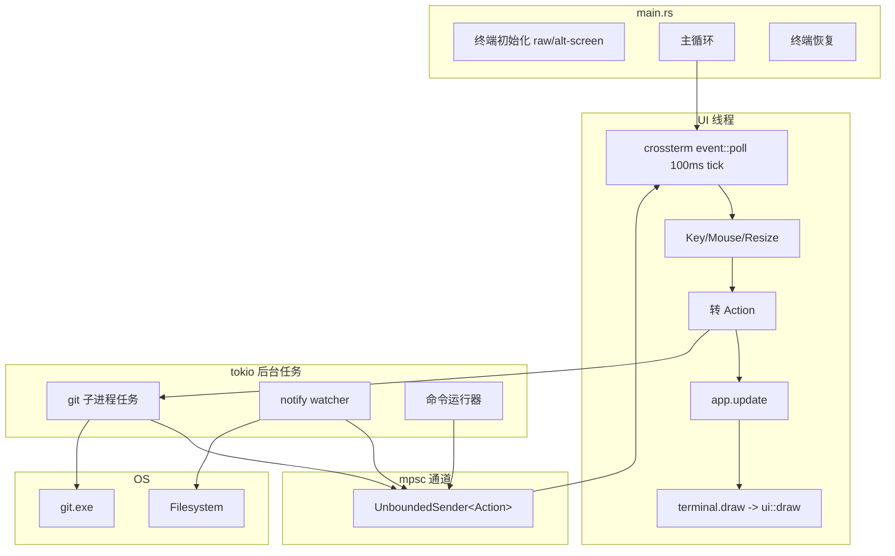
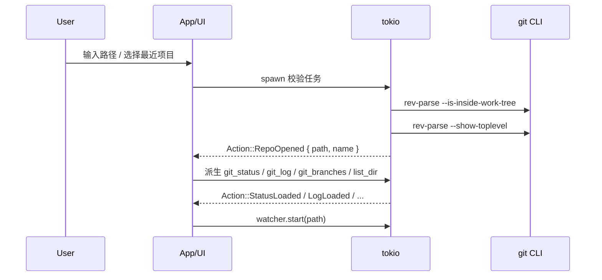
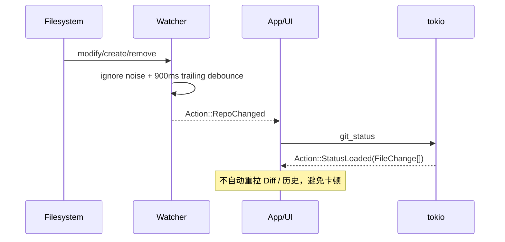
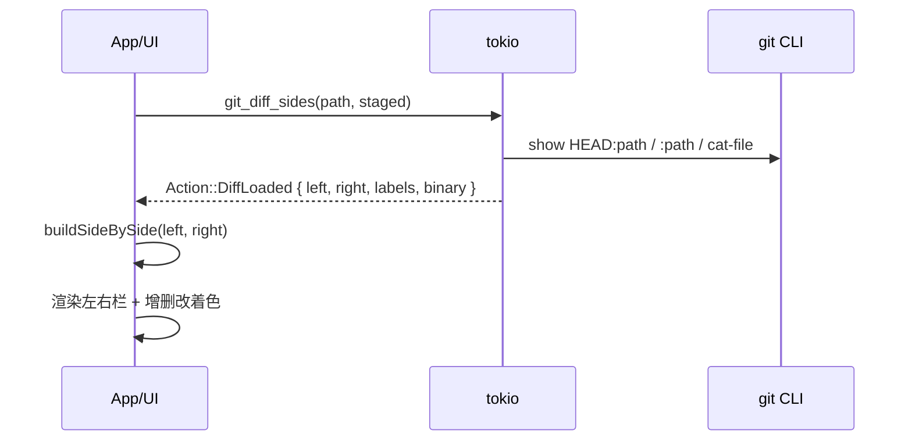

# 01 · 产品概述

## 1.1 背景与目标

GitDiff TUI 是 GitDiff 的终端版本，与 GUI 版共享同一产品定位——**本地 Windows 轻量 Git 客户端**，但运行于纯文本终端中：

- 像 `lazygit` / `gitui` 一样键盘驱动、即时反馈
- 像 SourceTree 一样浏览提交历史与文件变更
- 额外提供文件树浏览编辑、左右 Diff 对比、内置命令运行器
- 单二进制、无 WebView 依赖、启动快、可 SSH 到远程机器使用

核心目标：**键盘优先、界面轻、不离开终端、复用系统 Git 凭据**。

## 1.2 功能范围（当前版本）

### 已实现

| 能力       | 说明                                         |
| ---------- | -------------------------------------------- |
| 打开仓库   | 手动输入路径 / 从最近项目选择；必须是 Git 仓库 |
| 最近项目   | 本地 JSON 持久化，最多 20 条                 |
| 变更列表   | staged / unstaged / untracked                |
| 暂存与提交 | stage / unstage / commit                     |
| 远程操作   | pull（merge）/ push                          |
| Diff       | 左右对比 + 统一视图；增删改着色；差异点跳转  |
| 分支       | 列表、切换、创建                             |
| 历史       | 最近 100 条提交；文件列表；详情区查看 patch  |
| 文件树     | 浏览仓库文件，打开并编辑、保存               |
| 终端       | 底部可折叠命令运行器（执行任意命令并回显输出）|
| 主题       | 深色 / 浅色（或跟随终端），配置文件记忆      |
| 日志       | 文件日志 `logs/gitdiff.log` + 快捷键查看     |
| 帮助       | 快捷键速查面板                               |

### 明确不做（首版）

- Merge / Rebase 可视化、冲突解决 UI
- Stash、子模块、多远程高级管理
- 内置账号密码弹窗（走系统 credential helper / SSH agent）
- 云同步、公网暴露、内网穿透
- 完整内嵌 PTY 终端模拟（v1 用命令运行器替代，见 4.7）

## 1.3 技术选型

| 层级        | 选型                    | 原因                                    |
| ----------- | ----------------------- | --------------------------------------- |
| 语言        | Rust                    | 单二进制、内存安全、与 Git 生态契合     |
| TUI 框架    | `ratatui`               | 社区活跃、组件/布局成熟、跨平台         |
| 终端后端    | `crossterm`             | 原始模式/事件/跨平台，与 ratatui 官方配合 |
| 异步运行时  | `tokio`                 | 后台 git 进程、文件监听、通道投递       |
| Git         | 系统 `git` CLI          | 凭据/SSH 直接复用，功能完整             |
| 文件监听    | `notify`                | 工作区变更后刷新 status                 |
| Diff 算法   | `similar`（可选）/ 自实现 | 基于两侧文本构建左右对比行            |
| 命令行解析  | `clap`                  | 启动参数（如 `-C <path>` 直开仓库）     |
| 配置/持久化 | `serde` + `serde_json` + `dirs` | 最近项目、主题等              |
| 日志        | `tracing` + `tracing-subscriber` / `tracing-appender` | 文件日志 + 级别控制 |

## 1.4 运行约束

1. 本机需安装 Git，并在 `PATH` 中可用。
2. 仅本地使用：不上传仓库内容，不生成公网链接，不做端口映射/穿透。
3. 推送鉴权依赖系统已配置的凭据助手或 SSH agent。
4. 日志优先写到可执行文件同级 `logs/`；若目录不可写（如 Program Files），回退到 `%LOCALAPPDATA%\GitDiffTUI\logs\`。
5. 需运行在支持 ANSI 转义的终端；Windows 推荐 Windows Terminal / ConHost（1607+ 已默认开启 VT 处理，crossterm 会自动开启）。
6. 终端尺寸过小（如 < 20 行）时给出提示并最小化可用布局，不崩溃。

## 1.5 版本信息

- 产品名：`GitDiff TUI`
- 版本：`0.1.0`
- 二进制名：`gitdiff-tui`（Windows：`gitdiff-tui.exe`）
- 默认最小终端尺寸：`100×30`（列×行），低于此值仍可运行但布局收缩

# 02 · 整体架构

## 2.1 进程与线程模型

TUI 版为 **单进程、单 UI 线程 + 后台 tokio 任务** 模型：



## 2.2 核心组件职责

| 组件               | 职责                                    |
| ------------------ | --------------------------------------- |
| `main.rs`          | 初始化 tokio、终端、日志，启动主循环     |
| `event.rs`         | `Event` / `Action` / 键位定义           |
| `app.rs`           | `App` 状态 + `update(Action)` 归约       |
| `tui.rs`           | 终端 raw/alt-screen 进入与恢复、主循环   |
| `ui/*`             | 各面板渲染（纯函数：`&App` → `Frame`）   |
| `git/*`            | `git` CLI 封装与 porcelain 解析          |
| `watcher.rs`       | 工作区监听 + 900ms 防抖                  |
| `recent.rs`        | `recent-projects.json`                   |
| `terminal.rs`      | 命令运行器（v1）/ PTY（扩展）            |
| `log.rs`           | 文件日志初始化与级别控制                 |

## 2.3 核心原则

1. **Git 真相源在 CLI**：所有 Git 语义以本机 `git` 为准，UI 只做展示与编排。

2. **命令薄封装**：统一 `run_git`，解析 porcelain / log 输出后返回结构化数据。

3. **单线程归约 + 异步执行**：所有状态变更集中在 `app.update(Action)` 中同步完成；慢操作（git/监听）丢到 tokio 后台，结果通过 mpsc 以 `Action` 回投。**杜绝在渲染线程阻塞。**

4. **渲染是纯函数**：`ui::draw` 只读 `App`，无副作用、无 I/O；保证任意帧可重绘。

5. **性能优先**：
   - 仅变更列表随 watcher 刷新，不重拉 Diff / 历史
   - Diff 大文件截断渲染（默认 2000 行）
   - FS 监听忽略 `node_modules` / `.git` 等噪声目录
   - 事件循环用 `poll` + tick，不忙等

## 2.4 主交互数据流

### 打开仓库



### 文件变更自动刷新



### 左右 Diff



## 2.5 安全边界

- 所有文件读写路径必须落在当前仓库根目录下（防路径穿越）。
- 命令运行器与 Git 都在本地进程执行，不对外暴露端口。
- `GIT_TERMINAL_PROMPT=0`，避免命令卡在交互凭据提示。
- 命令运行器对危险命令不做拦截（本地工具、非特权环境），但默认只读执行、输出回显。

# 03 · 模块设计

## 3.1 仓库目录结构

```text
gitdiff-tui/
├── docs/                      # 设计文档
├── src/
│   ├── main.rs                # 入口：tokio + 终端 + 主循环
│   ├── app.rs                 # App 状态与 update(Action)
│   ├── event.rs               # Event / Action / Key 定义
│   ├── tui.rs                 # 终端初始化/恢复 + 主循环
│   ├── ui/
│   │   ├── mod.rs             # draw 入口 + 布局
│   │   ├── welcome.rs         # 欢迎页（打开仓库/最近项目）
│   │   ├── workspace.rs       # 工作区总布局
│   │   ├── changes.rs         # 变更列表
│   │   ├── diff.rs            # 左右/统一 Diff
│   │   ├── history.rs         # 提交历史 + 详情
│   │   ├── filetree.rs        # 文件树
│   │   ├── editor.rs          # 文本编辑
│   │   ├── branches.rs        # 分支
│   │   ├── commit.rs          # 提交框
│   │   ├── command.rs         # 命令运行器面板
│   │   ├── help.rs            # 快捷键帮助
│   │   └── style.rs           # 主题/配色/符号
│   ├── git/
│   │   ├── mod.rs             # run_git / check_git / 仓库判定
│   │   ├── parse.rs           # status/log/branch/name-status 解析
│   │   └── types.rs           # FileChange/CommitInfo/BranchInfo/DiffSides
│   ├── diff.rs                # side-by-side 行对齐算法
│   ├── watcher.rs             # 工作区监听 + 防抖
│   ├── recent.rs              # recent-projects.json
│   ├── terminal.rs            # 命令运行器（v1）/ PTY（扩展）
│   └── log.rs                 # 日志目录解析与初始化
├── Cargo.toml
└── README.md
```

## 3.2 模块职责

| 模块                    | 职责                                       |
| ----------------------- | ------------------------------------------ |
| `app.rs`                | 全部 UI 状态、当前面板、`update` 归约逻辑  |
| `event.rs`              | 输入事件 → `Action` 映射、键位表           |
| `tui.rs`                | `crossterm` 初始化、主循环、退出恢复       |
| `ui/mod.rs`             | `draw(frame, app)` 入口，按模式分派布局    |
| `ui/workspace.rs`       | 三栏 + 底部终端布局、比例约束              |
| `git/mod.rs`            | `run_git` / `check_git` / 路径校验         |
| `git/parse.rs`          | porcelain 文本 → 结构化数据                |
| `diff.rs`               | 两侧文本 → 对齐 Diff 行（equal/add/del/mod）|
| `watcher.rs`            | `notify` 递归监听 + 900ms 防抖             |
| `recent.rs`             | 最近项目持久化（20 条、置顶）              |
| `terminal.rs`           | 命令运行器：spawn + stdout 回显 + 退出     |
| `log.rs`                | `tracing` 文件输出 + 目录回退              |

## 3.3 模块依赖关系（简化）

```text
main
 ├─ tui ── app ── ui/*（渲染）
 │         │
 │         ├─ git/*（后台调用，经 Action 回投）
 │         ├─ watcher（后台，经 Action 回投）
 │         ├─ terminal（后台，经 Action 回投）
 │         └─ recent / log（同步，轻量 I/O）
 └─ event ── app.update
```

依赖规则：

- `ui/*` 只依赖 `app`（读状态）与 `style`，不直接调 `git`。
- `app` 依赖 `git/types`（数据类型），但不持有 git 进程句柄；慢调用一律 `spawn`。
- 后台任务通过共享 `mpsc::UnboundedSender<Action>` 回投结果。

# 04 · 核心设计（Rust / ratatui）

## 4.1 启动流程

`src/main.rs`：

1. 解析命令行参数（`clap`）：`-C/--directory <path>` 直接打开仓库、`--log-level`。
2. 初始化日志（`log::init`）→ 解析日志目录。
3. 检测 Git（`check_git`）；缺失则打印错误并退出（不进入 TUI）。
4. 创建 tokio 运行时与 `mpsc` 通道。
5. `tui::init()` 进入 raw 模式 + alternate screen。
6. 进入主循环；退出前 `tui::restore()` 恢复终端。

日志目标：

- 文件：`<exe_dir>/logs/gitdiff.log`（失败则回退 LocalAppData）
- 级别：默认 `info`，`-v` 提升到 `debug`

## 4.2 主循环与事件归约

`src/tui.rs` 主循环骨架：

```rust
loop {
    // 1. 轮询输入（tick 驱动 watcher 防抖与定时刷新）
    if event::poll(Duration::from_millis(100))? {
        match event::read()? {
            Event::Key(k) => { if let Some(a) = key_to_action(k, &app) { app.update(a)?; } }
            Event::Mouse(m) => { app.update(Action::Mouse(m))?; }
            Event::Resize(w, h) => { app.update(Action::Resize { w, h })?; }
            _ => {}
        }
    }

    // 2. 吸收后台任务回投的 Action
    while let Ok(a) = rx.try_recv() {
        app.update(a)?;
    }

    // 3. 渲染
    terminal.draw(|f| ui::draw(f, &mut app))?;

    // 4. 退出条件
    if app.should_quit { break; }
}
```

`app.update(Action) -> Result<()>` 是唯一的同步状态入口，内部按当前 `Mode`（Welcome / Workspace）与 `PanelFocus` 分发。副作用（git 调用）通过 `app.spawn(action)` 派发到 tokio。

### Action 定义（节选）

```rust
pub enum Action {
    Quit,
    Tick,
    Key(KeyEvent),
    Mouse(MouseEvent),
    Resize { w: u16, h: u16 },

    // 仓库
    OpenRepo { path: PathBuf },
    RepoOpened { path: PathBuf, name: String },
    CloseRepo,

    // Git 结果回投
    StatusLoaded(Vec<FileChange>),
    LogLoaded(Vec<CommitInfo>),
    BranchesLoaded(Vec<BranchInfo>),
    DiffLoaded { path: String, sides: DiffSides },
    CommitFilesLoaded { hash: String, files: Vec<CommitFile> },

    // 变更
    SelectFile { index: Option<usize> },
    Stage { paths: Vec<String> },
    Unstage { paths: Vec<String> },
    Commit { message: String },
    Push,
    Pull,

    // 历史 / 分支 / 文件
    SelectCommit { index: Option<usize> },
    Checkout { branch: String },
    CreateBranch { name: String },
    OpenFile { path: String },
    SaveFile { path: String, content: String },

    // 面板 / 视图
    SetLeftTab(LeftTab),
    SetCenterView(CenterView),
    FocusNext,
    FocusPrev,
    ToggleTerminal,
    RepoChanged,
}
```

## 4.3 Git CLI 封装

文件：`src/git/mod.rs`

### `run_git(cwd, args) -> Result<GitOutput>`

- 进程：`git <args>`，工作目录为仓库路径
- 环境：`GIT_TERMINAL_PROMPT=0`，`LANG/LC_ALL=C`
- Windows：`CREATE_NO_WINDOW`，避免弹出控制台黑窗
- 返回：`{ stdout, stderr, code }`
- 日志策略：
  - `status/diff/log/branch/show/rev-parse` 成功走 debug（默认不刷屏）
  - `commit/push/pull/checkout` 等走 info
  - `diff` exit code `1` 视为“有差异”，不算失败
- 因 `tokio::process::Command` 异步执行，调用方 `spawn` 后把结果包成 `Action` 回投。

### 解析器（`git/parse.rs`）

| 输入                              | 输出                                           |
| --------------------------------- | ---------------------------------------------- |
| `git status --porcelain=v1 -uall` | `FileChange[]`（含 staged/unstaged/untracked） |
| `git log --pretty=format:...`     | `CommitInfo[]`                                 |
| `git show --name-status`          | `CommitFile[]`                                 |
| `git branch --list`               | `BranchInfo[]`                                 |

Status 中同一文件可同时出现 staged + unstaged 两条记录（如 `MM`）。

## 4.4 仓库与最近项目

### 打开仓库 `open_repo`

1. 校验目录存在
2. `rev-parse --is-inside-work-tree`
3. `rev-parse --show-toplevel` 归一化根路径
4. 写入最近项目
5. 启动 watcher
6. 回投 `RepoOpened { path, name }`，随后批量加载 status / log / branches / 目录

### 最近项目 `recent.rs`

- 路径：`app_data_dir/recent-projects.json`（`dirs` crate 定位）
- 字段：`path` / `name` / `lastOpenedAt`
- 上限：20 条，打开成功后置顶

## 4.5 文件监听 `watcher.rs`

- crate：`notify` 递归监听仓库根
- 忽略目录/文件：`.git`、`node_modules`、`target`、`dist`、`build`、锁文件等
- 忽略事件类型：Access / Other
- 防抖：trailing **900ms**（安静后才 emit）
- 通过通道回投 `Action::RepoChanged`
- 切换/关闭仓库时停止旧 watcher

## 4.6 Diff 两侧内容 `git_diff_sides`

根据区域决定左右文本：

| 场景          | Left             | Right            |
| ------------- | ---------------- | ---------------- |
| staged        | `HEAD:path`      | `:path`（index） |
| untracked     | 空               | 工作区文件       |
| 其他 unstaged | `:path`（index） | 工作区文件       |

含二进制检测（前 8KB 出现 `NUL` 则 `binary=true`）。

同时保留 `git diff` 输出 unified patch，供统一视图使用。

### 左右对齐算法 `src/diff.rs`

1. 用行级 diff（`similar` 或自实现 LCS/Myers）得到变更块
2. 相邻 `removed + added` 合并为 **修改（mod）**
3. 生成对齐行：`equal | add | del | mod`
4. 默认最多 2000 行，防止超大文件卡死
5. 每行渲染为 `Line`/`Span`，仅渲染可视窗口内的行（虚拟滚动），避免整文件写帧

跳转逻辑：

- 收集非 `equal` 行索引
- 「上一个 / 下一个」移动高亮 `active-hunk`

## 4.7 终端 / 命令运行器 `terminal.rs`

TUI 内嵌完整 PTY 终端模拟成本高（需终端模拟器 crate），v1 采用**命令运行器**折中：

| 命令            | 作用                                            |
| --------------- | ----------------------------------------------- |
| `cmd_spawn`     | 在仓库 cwd 启动命令（`cmd /c` 或用户输入）       |
| 输出回显        | stdout/stderr 合并后逐帧追加到滚动缓冲          |
| `cmd_kill`      | 终止运行中的子进程                              |

特点：

- 底部面板，可折叠、可调高
- 输入行支持历史（上下键）、`Enter` 执行、`Ctrl+C` 中断
- 输出仅保留尾部 N 行（环形缓冲，如 2000 行），避免内存/帧开销

扩展点（后续）：

- 引入 `portable-pty` + `termwiz`（或 `alacritty/vte`）做真 PTY 内嵌
- 会话管理：`HashMap<id, session>`，多会话 Tab 切换

## 4.8 远程与分支

- `git_push` / `git_pull --rebase=false`
- 成功时 stderr 也可能有信息，需合并展示
- 分支：`branch --list` / `checkout` / `checkout -b`

## 4.9 错误处理约定

- 后台任务失败回投 `Action::Error(String)`，写入日志并显示顶部状态栏
- Git 缺失时启动即报错退出
- 成功操作不打断用户（仅刷新数据），失败才弹出提示条

# 05 · 界面与交互设计（ratatui）

## 5.1 布局体系

ratatui 用 `Layout` 约束划分区域，v1 采用固定栅格 + 比例混合：

```text
┌──────────────────────────────────────────────────────────────┐
│ GitDiff TUI  repo-name  [branch]  [帮助?] [终端^] [退出q]     │  ← 顶栏 (1 行)
├────────────┬─────────────────────────────────┬───────────────┤
│ 变更 | 文件 │ 差异 | 编辑 | 历史详情            │ History       │
│ (Tab 切换) │                                   │               │
│            │  主内容区                          │  提交列表     │
│  列表/树   │                                   │──────────────│
│            │───────────────────────────────────│  变更文件列表 │
│            │ Commit message / 提交·拉取·推送     │               │
├────────────┴─────────────────────────────────┴───────────────┤
│ 终端 / 命令运行器（可折叠、可调高）                             │
│ 状态栏（repo-changed 提示 / 错误 / 键位提示）                  │
└──────────────────────────────────────────────────────────────┘
```

栅格大致比例：`30% | 1fr | 30%`（用 `Constraint::Percentage` / `Ratio`）。

实现要点：

- `ui::draw` 顶层先按 `Mode` 分派：`Welcome` 全屏，`Workspace` 走上述布局。
- 各面板用 `Block::bordered()` 加边框 + 标题；聚焦面板用 accent 色标题。
- 长路径/文件名用 `Line::from(...)` + 截断，配合 `Paragraph::wrap`/`scroll`。

## 5.2 状态与焦点模型

`App` 持有：

```rust
pub enum Mode { Welcome, Workspace }

pub enum LeftTab { Changes, Files }
pub enum CenterView { Diff, Editor, HistoryDiff }

pub enum PanelFocus { Left, Center, History, Terminal, None }

pub struct App {
    pub mode: Mode,
    pub repo: Option<RepoState>,
    pub focus: PanelFocus,
    pub left_tab: LeftTab,
    pub center_view: CenterView,
    pub changes: ChangesState,
    pub history: HistoryState,
    pub branches: BranchState,
    pub filetree: FileTreeState,
    pub editor: EditorState,
    pub terminal: TerminalState,
    pub help_open: bool,
    pub theme: Theme,
    pub should_quit: bool,
    // ...
}
```

焦点切换：`Tab` / `Shift+Tab` 循环，或 `1`/`2`/`3`/`4` 直达。

## 5.3 快捷键表

### 全局

| 键            | 动作             |
| ------------- | ---------------- |
| `q` / `Ctrl+C`| 退出             |
| `?`           | 帮助面板         |
| `Tab`/`Shift+Tab` | 切换焦点面板 |
| `1`/`2`/`3`/`4` | 焦点直达：左/中/右/终端 |
| `t`           | 折叠/展开终端    |
| `r`           | 刷新当前视图     |
| `p`           | 打开仓库（Welcome 模式）|

### 变更列表（左栏 · Changes）

| 键        | 动作                  |
| --------- | --------------------- |
| `j`/`↓`、`k`/`↑` | 移动光标      |
| `space`   | stage（未暂存→暂存）  |
| `u`       | unstage               |
| `Enter`   | 查看该文件 Diff       |
| `a`       | stage 全部            |
| `c`       | 进入提交框           |
| `g`/`G`   | 跳到首/尾            |

### Diff / 详情（中栏）

| 键          | 动作                    |
| ----------- | ----------------------- |
| `j`/`k`、`↑`/`↓` | 滚动            |
| `Tab`       | 左右视图 ↔ 统一视图     |
| `n`/`N`     | 上一个/下一个差异点     |
| `g`/`G`     | 跳到首/尾              |

### History（右栏）

| 键          | 动作                    |
| ----------- | ----------------------- |
| `j`/`k`     | 移动光标               |
| `Enter`     | 选中提交，列出变更文件   |
| `Enter`（文件上）| 在中栏查看 patch   |
| `g`/`G`     | 跳到首/尾              |

### 文件树（左栏 · Files）

| 键          | 动作                    |
| ----------- | ----------------------- |
| `j`/`k`     | 移动光标               |
| `Enter`/`l` | 展开目录 / 打开文件      |
| `h`         | 收起目录               |
| `e`         | 在编辑器打开           |

### 编辑器（中栏 · Editor）

| 键        | 动作          |
| --------- | ------------- |
| 方向键    | 移动光标      |
| `Ctrl+S`  | 保存          |
| 普通字符  | 插入（简单行编辑）|

### 分支

| 键          | 动作              |
| ----------- | ----------------- |
| `b`         | 打开分支面板      |
| `Enter`     | 切换到该分支      |
| `c`         | 新建分支（输入名）|

### 提交框 / 输入模式

| 键        | 动作                |
| --------- | ------------------- |
| `Enter`   | 确认（提交/建分支） |
| `Esc`     | 取消                |

### 终端 / 命令运行器

| 键        | 动作                |
| --------- | ------------------- |
| `i`       | 聚焦输入行          |
| `Enter`   | 执行命令            |
| `↑`/`↓`   | 命令历史            |
| `Ctrl+C`  | 中断运行中的命令    |

## 5.4 关键交互流

### 变更 → Diff

1. 左栏「变更」`j/k` 选文件
2. `Enter` → 中栏切到「差异」
3. 默认左右对比；`Tab` 切统一视图
4. `n/N` 跳差异点

### 文件树 → 编辑

1. 左栏切「文件」（`1` 后 `Tab` 或直接焦点）展开、选文件
2. `e` 打开 → 中栏切「编辑」
3. 修改后状态栏提示「未保存」；`Ctrl+S` 保存

### History → 历史详情

1. 右栏 `j/k` 选提交 → `Enter` 列出变更文件
2. 文件上 `Enter` → 中栏「历史详情」展示彩色 patch

### 提交

1. `c` 打开提交框 → 输入 message → `Enter`
2. 提交成功后刷新 status / log

### 终端 / 命令

1. `t` 展开底部面板，`i` 聚焦输入
2. 输入命令 `Enter` 执行，输出滚动回显
3. `Ctrl+C` 中断

## 5.5 主题与配色

`src/ui/style.rs` 定义 `Theme`，语义色与 GUI 版一致：

| 语义     | 颜色意图 | 出现位置                       |
| -------- | -------- | ------------------------------ |
| 新增     | 绿       | 变更标签、Diff 行、历史 status |
| 删除     | 红       | 同上                           |
| 修改     | 琥珀     | 同上                           |
| 强调操作 | 青 accent | 聚焦边框、激活 Tab、分支 hash |
| 状态信息 | 灰       | 状态栏、键位提示               |

实现：

- 深色默认，浅色可选（`--theme light` 或配置文件）
- 检测终端颜色能力：`Color::Rgb` 用于 truecolor，回退 `Color::Indexed` / `Color::AnsiValue`
- 样式集中在 `style.rs`，各面板只引用语义常量（如 `Style::diff_add()`）

## 5.6 可达性与可用性注意

- 全键盘可达，鼠标可选（点击聚焦、滚轮滚动）
- 状态栏常驻显示当前面板可用键位提示
- 空态文案明确引导（如“尚未打开仓库，按 p 打开”）
- 终端过小时收缩面板，最小时保留单面板 + 状态栏

# 06 · 数据与状态 API

TUI 版无跨进程 invoke，改为**内部 Action 通道**。本节列数据结构（与 GUI 对齐）。

## 6.1 核心类型

```rust
// git/types.rs
pub struct FileChange {
    pub path: String,
    pub old_path: Option<String>,
    pub index_status: String,
    pub worktree_status: String,
    pub area: Area,          // Staged | Unstaged | Untracked
    pub status_label: String,
}

pub struct DiffSides {
    pub left: String,
    pub right: String,
    pub left_label: String,
    pub right_label: String,
    pub binary: bool,
}

pub struct CommitInfo {
    pub hash: String,
    pub subject: String,
    pub author: String,
    pub date: String,
}

pub struct CommitFile {
    pub path: String,
    pub status: String,
}

pub struct BranchInfo {
    pub name: String,
    pub is_current: bool,
}

pub struct RecentProject {
    pub path: String,
    pub name: String,
    pub last_opened_at: i64,
}
```

## 6.2 后台任务 → Action 映射

| 后台调用                       | 回投 Action                    |
| ------------------------------ | ------------------------------ |
| `git status`                   | `StatusLoaded(Vec<FileChange>)`|
| `git log`                      | `LogLoaded(Vec<CommitInfo>)`   |
| `git branch`                   | `BranchesLoaded(Vec<BranchInfo>)` |
| `git_diff_sides`               | `DiffLoaded { path, sides }`   |
| `git show --name-status`       | `CommitFilesLoaded { hash, files }` |
| `git diff <commit> -- <file>`  | `HistoryDiffLoaded { .. }`     |
| `list_dir`                     | `DirLoaded { path, entries }`  |
| `git commit/push/pull/checkout`| `OpFinished(String)` / `Error(String)` |
| watcher 防抖触发               | `RepoChanged`                  |
| 命令运行器输出/退出            | `CmdOutput { data }` / `CmdExit` |

## 6.3 持久化数据位置

| 数据     | 位置                                        |
| -------- | ------------------------------------------- |
| 最近项目 | `app_data_dir/recent-projects.json`         |
| 文件日志 | `<exe_dir>/logs/gitdiff.log`（优先）        |
| 日志回退 | `%LOCALAPPDATA%\GitDiffTUI\logs\`           |
| 主题偏好 | `config_dir/gitdiff-tui/config.json`（预留）|

# 07 · 构建与发布

## 7.1 环境要求

- Rust + Cargo（stable）
- 本机 Git（运行时依赖）
- 支持 ANSI/VT 的终端（Windows Terminal 推荐）

## 7.2 常用命令

```bash
# 开发运行（直接在当前目录打开）
cargo run

# 直接打开指定仓库
cargo run -- -C <repo-path>

# 调试级别日志
cargo run -- -v

# 构建 release
cargo build --release

# 生成 Windows 安装包（可选，wix/NSIS 后期）
cargo install cargo-wix   # 后续可选
```

## 7.3 产物位置

| 产物         | 路径                                  |
| ------------ | ------------------------------------- |
| 可执行文件   | `target/release/gitdiff-tui.exe`      |

（可选）交叉编译/单文件分发：`gitdiff-tui` 为静态单二进制，直接复制即可运行。

## 7.4 验收清单（建议）

1. 无 Git 时启动有明确提示并退出
2. 打开真实仓库，改文件后变更列表自动更新（watcher 防抖生效）
3. 暂存 / 提交 / Diff 左右对比与跳转正常
4. Push/Pull 走系统凭据，错误可读
5. 历史点文件能在中栏看到详情
6. 文件树可展开子目录，编辑保存后出现在变更
7. 命令运行器可执行命令并回显输出
8. 退出后终端恢复正常（raw 模式正确还原）
9. 终端过小时不崩溃，布局收缩可用
10. 重启后最近项目与主题仍在

## 7.5 已知限制

- 超大仓库递归监听仍可能有开销（已忽略常见噪声目录）
- Diff 超大文件会截断显示行数
- 首版无冲突可视化解决
- v1 命令运行器非完整 PTY 终端模拟（交互式 TUI 程序在其中不可用，扩展点见 4.7）
- 编辑器为简版行编辑，复杂编辑建议用外部 `$EDITOR`
